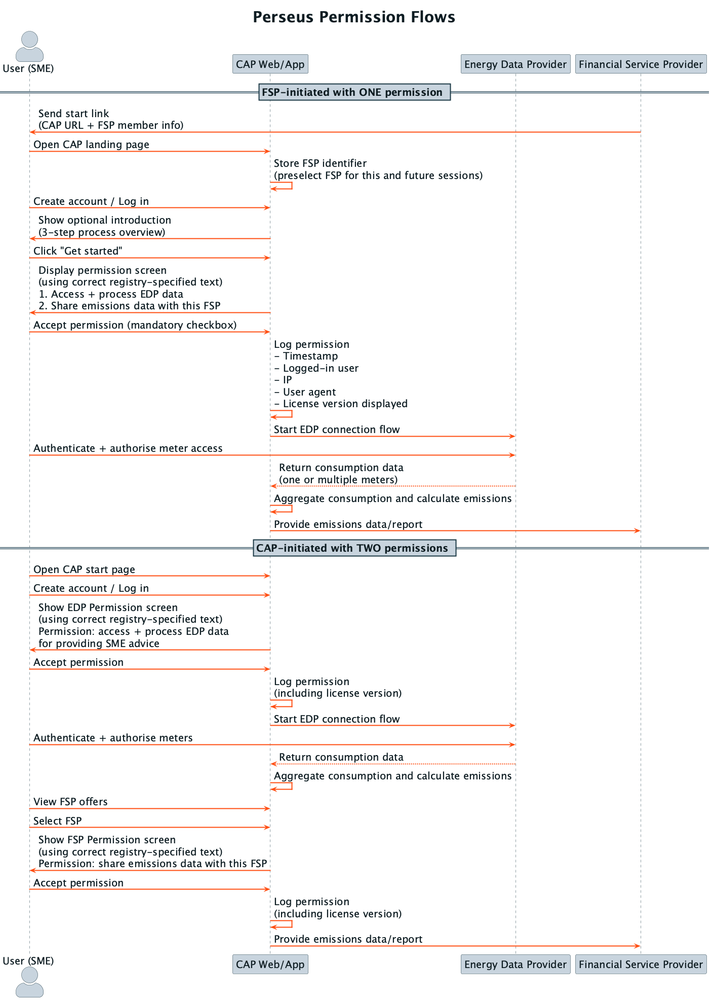

# Perseus permission flow diagram

Plantuml to produce a sequence diagram illustrating the perseus permission flow.

## Sequence diagram



## Regenerate a diagram after making changes

```bash
plantuml diagram.uml
```
